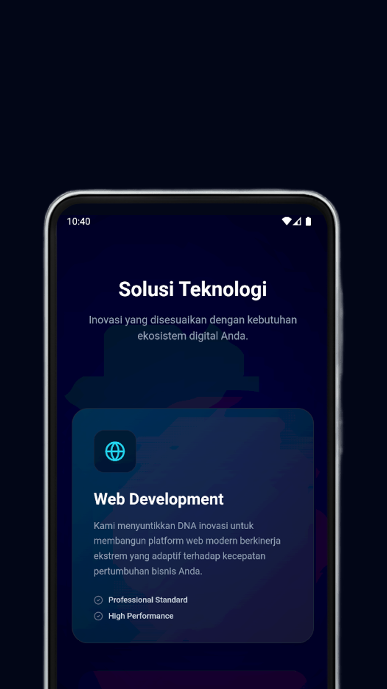
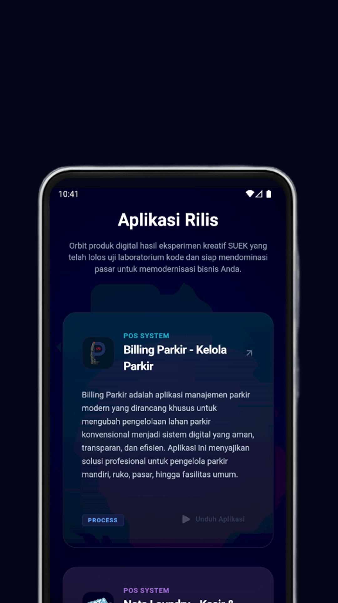
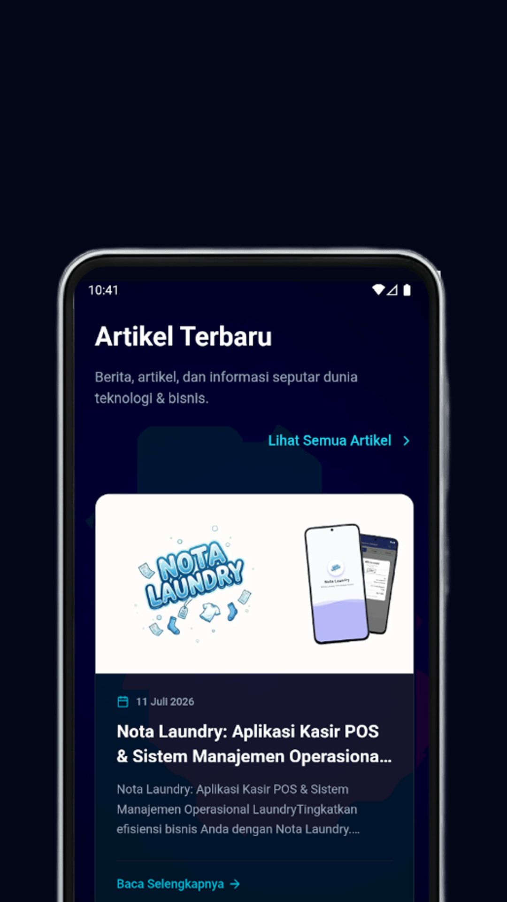

# SUEKTechAndroid

A high-performance hybrid Android application that embeds a modern Single Page Application (SPA) dashboard. Built as an MVP focused on speed, modular architecture, and seamless integration between native Android capabilities and web technologies.

> **Development Note:** This project was built 100% from scratch purely using **Visual Studio Code (VS Code)** as the primary IDE, utilizing command-line tools and manual configuration instead of standard Android Studio workflows.

---

## App Preview

<p align="center">
  
  
  
  
</p>

---

## Features

*   **Native Android Wrapper:** Uses Kotlin and optimized WebView configurations to load local encrypted production assets efficiently.
*   **Complete Authentication System:** Integrated login, protected routing, and user session management (`Login`, `ProtectedRoute`).
*   **Fully Functional Dashboard:** Comprehensive user management and analytics interface (`Dashboard`, `User Management`).
*   **CMS & Rich Text Editor:** Built-in blog post management using Quill Editor for content creation (`BlogList`, `BlogPost`).
*   **Smooth UX/UI:** Powered by modern physics-based motion animations for a native-like feel.
*   **Firebase Integration:** Production-ready backend configuration for data persistence and authentication.

---

## Tech Stack & Environment

*   **IDE:** Visual Studio Code (VS Code) - 100% custom configuration.
*   **Android Layer:** Kotlin, Gradle (Kotlin DSL), Android Jetpack.
*   **Frontend Engine:** JavaScript / TypeScript (SPA Architecture), Tailwind CSS.
*   **Libraries & SDKs:** Firebase SDK, Framer Motion, Quill Editor, Modern Client-side Routing.

---

## Project Structure

```
SUEKTechAndroid/
├── app/
│   ├── src/main/
│   │   ├── assets/          # Compiled production SPA assets (HTML, JS, CSS)
│   │   ├── java/            # Native Android source code (Kotlin)
│   │   └── res/             # Android native resources (Icons, XMLs)
│   └── build.gradle.kts     # App-level build configuration
├── screenshots/             # Repository documentation assets
└── settings.gradle.kts      # Project-level settings
```

---

## Installation & Setup

1. Clone the repository:
   ```bash
   git clone [https://github.com/USERNAME/SUEKTechAndroid.git](https://github.com/USERNAME/SUEKTechAndroid.git)
   ```
2. Open the project folder in **VS Code**.
3. Ensure you have the required `local.properties` configuration pointing to your Android SDK location.
4. Sync Gradle and build the project via terminal:
   ```bash
   ./gradlew build
   ```
5. Run the application on an emulator or a physical device using CLI commands.